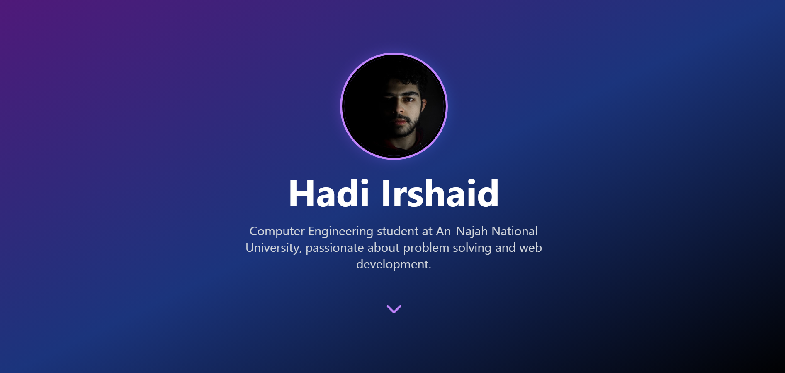

# Hadi Irshaid's Portfolio

Welcome to the GitHub repository for my personal portfolio website! This site showcases my projects, skills, and background as a Computer Engineering student with a passion for web development.

 <!-- Optional: Add a screenshot of the website -->

## Table of Contents
- [About the Project](#about-the-project)
- [Features](#features)
- [Technologies Used](#technologies-used)
- [Getting Started](#getting-started)
- [Usage](#usage)
- [Contact](#contact)

## About the Project

This portfolio website was created to provide a professional online presence and showcase my skills, projects, and experience.

## Technologies Used

- **HTML5** and **CSS3** for structure and styling.
- **JavaScript** for interactive and animated elements.
- **Bolt.new** for generating base code and layout ideas.
- **ChatGPT** for prompt optimization and bug fixing.
- **Github** for saving the project in a repository.
- **Netlify** for live deployment.

### Installation

1. Clone the repository:
   ```bash
   git clone https://github.com/Hadi87s/portfolio-website.git
